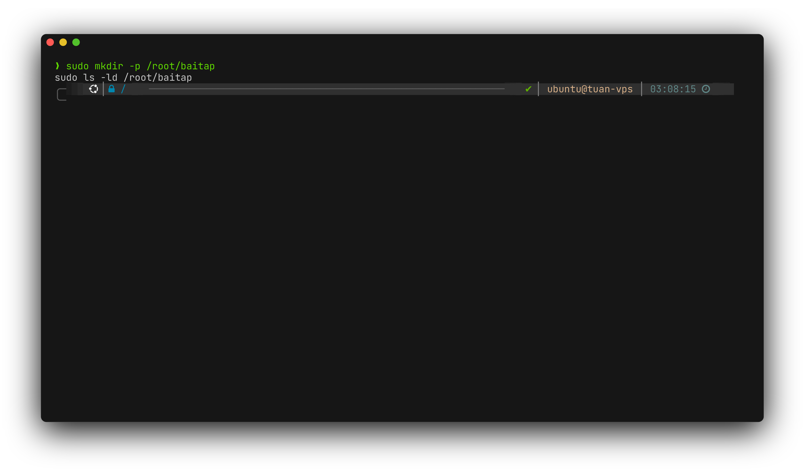
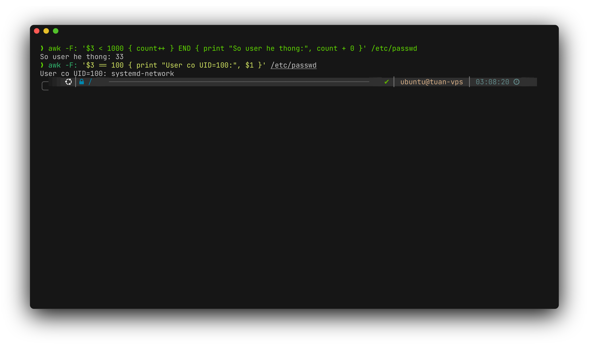
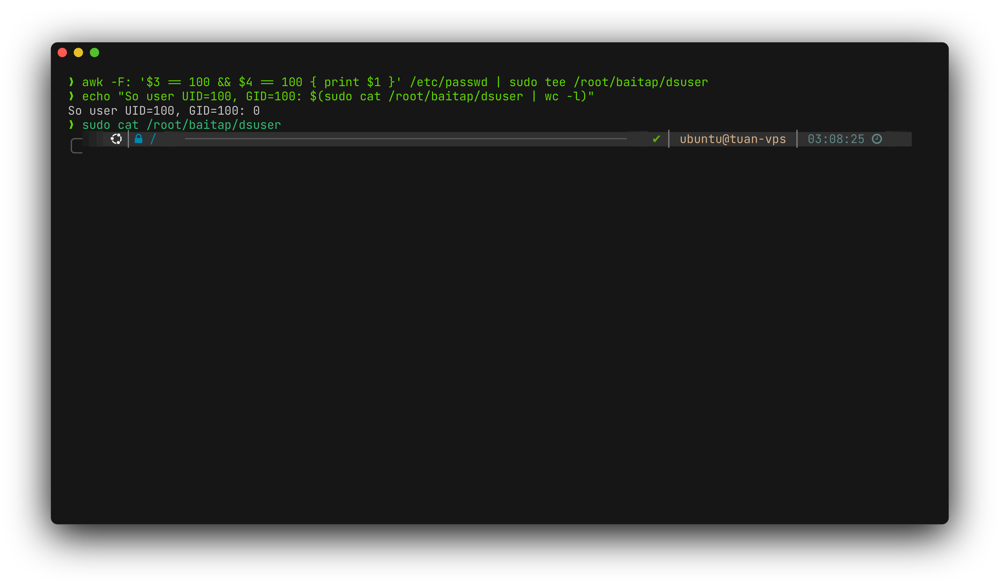
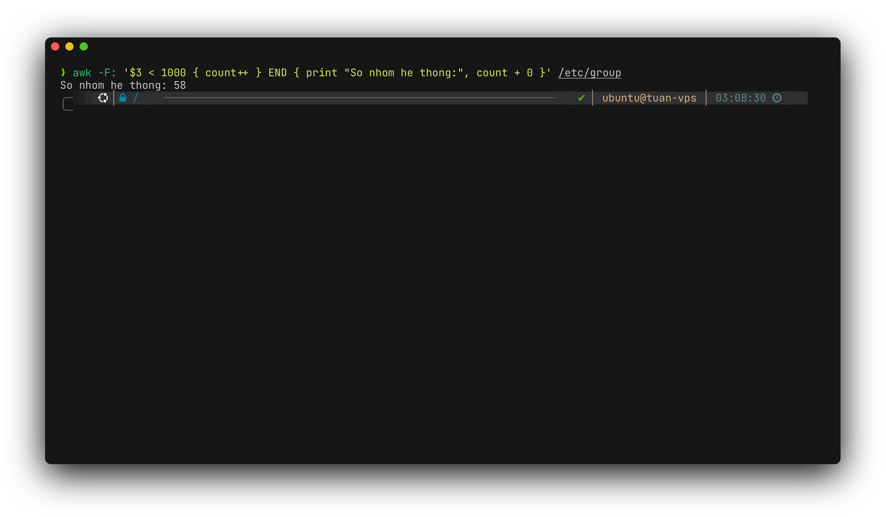
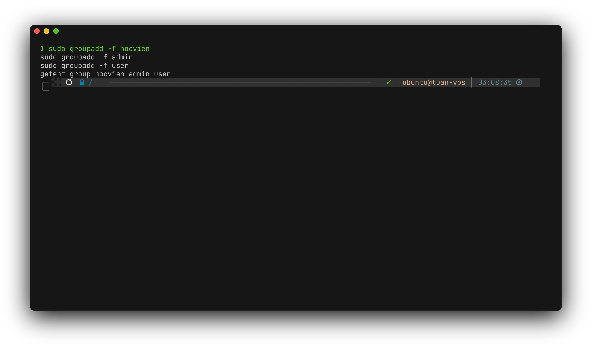
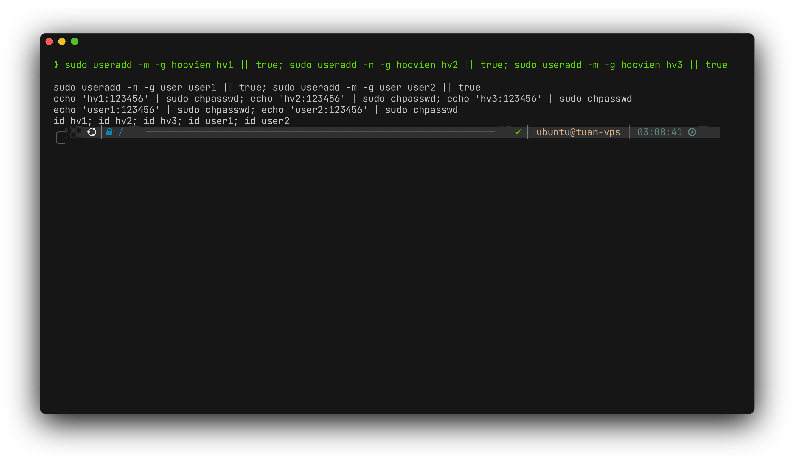
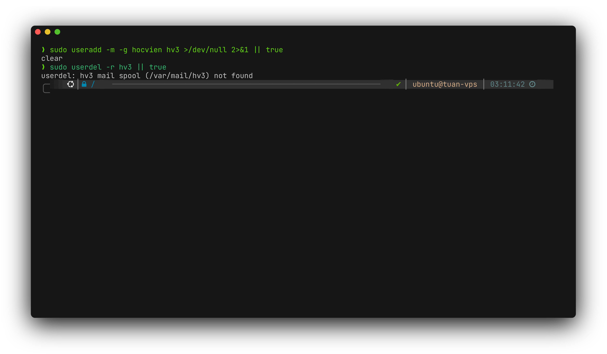
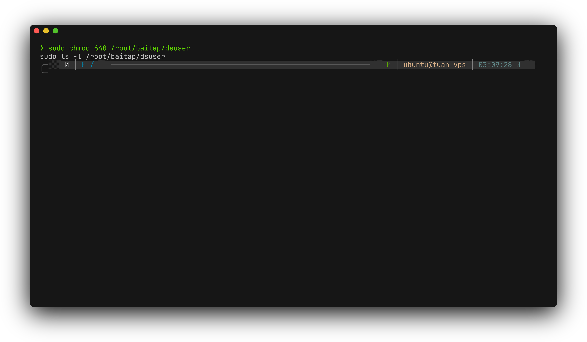
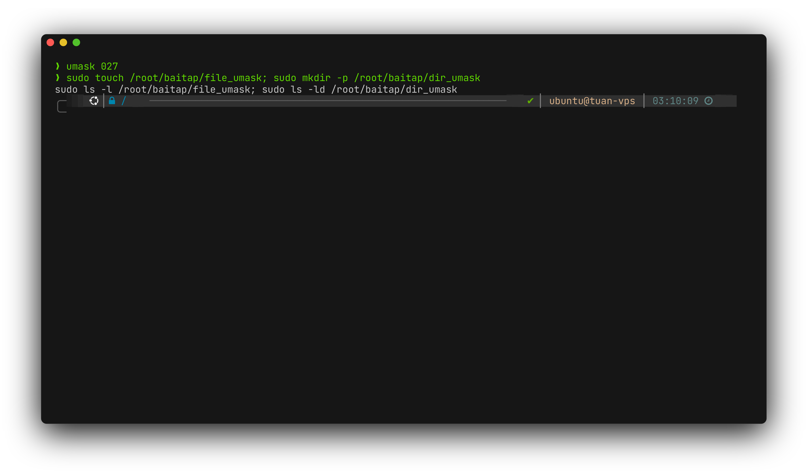
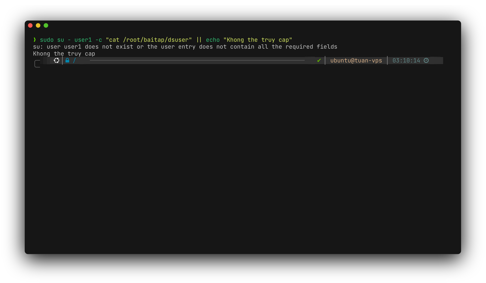

<div align="center">

# Bài tập Linux ngày 29/06

**Lời giải Đề của Sơn**

| Họ và tên | Mã sinh viên |
| --- | --- |
| Đỗ Văn Sơn | 2300412 |

</div>

## Cấu trúc thư mục

```text
.
├── README.md
├── scripts/
│   └── de_son.sh
└── tests/
    └── run_tests.sh
```

## Câu 1 (1 điểm)

Trong home directory của người dùng `root` tạo thư mục `baitap`.




## Câu 2 (1 điểm)

Xem nội dung tập tin `/etc/passwd` và cho biết có bao nhiêu người dùng do hệ thống tạo ra và có người dùng nào có `UID=100` không?




## Câu 3 (1 điểm)

Cho biết có bao nhiêu người dùng có `UID=100`, `GID=100`. Ghi nhận những người dùng này vào tệp tin `dsuser` trong thư mục `baitap`.




## Câu 4 (1 điểm)

Xem nội dung tập tin `/etc/group` và cho biết có bao nhiêu nhóm do hệ thống tạo ra.




## Câu 5 (1 điểm)

Tạo các nhóm sau:

* `hocvien`
* `admin`
* `user`




## Câu 6 (1 điểm)

* Trong nhóm `hocvien` tạo các người dùng:

  * `hv1`
  * `hv2`
  * `hv3`
* Trong nhóm `user` tạo các người dùng:

  * `user1`
  * `user2`

Các tài khoản đều có mật khẩu là `123456`.




## Câu 7 (1 điểm)

Hủy người dùng `hv3` trong nhóm `hocvien`.




## Câu 8 (1 điểm)

Cấp quyền cho tập tin `dsuser` như sau:

* Người sở hữu: đọc, ghi
* Nhóm: đọc
* Người khác: không có quyền




## Câu 9 (1 điểm)

Thiết lập quyền mặc định như sau:

* Người sở hữu: đọc, ghi
* Nhóm: đọc
* Người khác: không có quyền

Sau đó tạo tập tin, thư mục và so sánh quyền.




## Câu 10 (1 điểm)

Đăng nhập vào người dùng `user1` và truy cập vào tập tin `dsuser` xem có được hay không.



