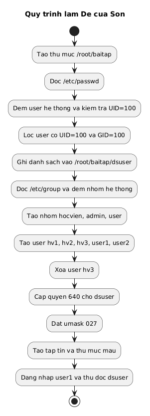
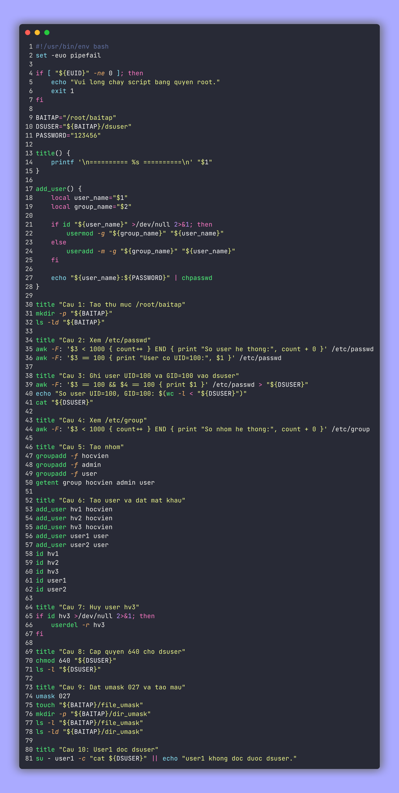

<div align="center">

# Bài tập Linux ngày 29/06

**Lời giải Đề của Sơn**

| Họ và tên | Mã sinh viên |
| --- | --- |
| Đỗ Văn Sơn | 2300412 |

</div>

## Cấu trúc thư mục

```text
.
├── README.md
├── assets/
│   ├── code-de-son.png
│   └── diagram-de-son.png
├── diagrams/
│   └── de_son_flow.puml
├── scripts/
│   └── de_son.sh
└── tests/
    └── run_tests.sh
```

## Câu 1 (1 điểm)

Trong home directory của người dùng `root` tạo thư mục `baitap`.

```bash
mkdir -p /root/baitap
ls -ld /root/baitap
```

## Câu 2 (1 điểm)

Xem nội dung tập tin `/etc/passwd` và cho biết có bao nhiêu người dùng do hệ thống tạo ra và có người dùng nào có `UID=100` không?

```bash
awk -F: '$3 < 1000 { count++ } END { print "So user he thong:", count + 0 }' /etc/passwd
awk -F: '$3 == 100 { print "User co UID=100:", $1 }' /etc/passwd
```

## Câu 3 (1 điểm)

Cho biết có bao nhiêu người dùng có `UID=100`, `GID=100`. Ghi nhận những người dùng này vào tệp tin `dsuser` trong thư mục `baitap`.

```bash
awk -F: '$3 == 100 && $4 == 100 { print $1 }' /etc/passwd > /root/baitap/dsuser
echo "So user UID=100, GID=100: $(wc -l < /root/baitap/dsuser)"
cat /root/baitap/dsuser
```

## Câu 4 (1 điểm)

Xem nội dung tập tin `/etc/group` và cho biết có bao nhiêu nhóm do hệ thống tạo ra.

```bash
awk -F: '$3 < 1000 { count++ } END { print "So nhom he thong:", count + 0 }' /etc/group
```

## Câu 5 (1 điểm)

Tạo các nhóm sau:

* `hocvien`
* `admin`
* `user`

```bash
groupadd -f hocvien
groupadd -f admin
groupadd -f user
getent group hocvien admin user
```

## Câu 6 (1 điểm)

* Trong nhóm `hocvien` tạo các người dùng:

  * `hv1`
  * `hv2`
  * `hv3`
* Trong nhóm `user` tạo các người dùng:

  * `user1`
  * `user2`

Các tài khoản đều có mật khẩu là `123456`.

```bash
useradd -m -g hocvien hv1
useradd -m -g hocvien hv2
useradd -m -g hocvien hv3
useradd -m -g user user1
useradd -m -g user user2

echo "hv1:123456" | chpasswd
echo "hv2:123456" | chpasswd
echo "hv3:123456" | chpasswd
echo "user1:123456" | chpasswd
echo "user2:123456" | chpasswd

id hv1; id hv2; id hv3; id user1; id user2
```

## Câu 7 (1 điểm)

Hủy người dùng `hv3` trong nhóm `hocvien`.

```bash
userdel -r hv3
```

## Câu 8 (1 điểm)

Cấp quyền cho tập tin `dsuser` như sau:

* Người sở hữu: đọc, ghi
* Nhóm: đọc
* Người khác: không có quyền

```bash
chmod 640 /root/baitap/dsuser
ls -l /root/baitap/dsuser
```

## Câu 9 (1 điểm)

Thiết lập quyền mặc định như sau:

* Người sở hữu: đọc, ghi
* Nhóm: đọc
* Người khác: không có quyền

Sau đó tạo tập tin, thư mục và so sánh quyền.

```bash
umask 027
touch /root/baitap/file_umask
mkdir -p /root/baitap/dir_umask
ls -l /root/baitap/file_umask
ls -ld /root/baitap/dir_umask
```

## Câu 10 (1 điểm)

Đăng nhập vào người dùng `user1` và truy cập vào tập tin `dsuser` xem có được hay không.

```bash
su - user1 -c "cat /root/baitap/dsuser"
```

## Sơ đồ xử lý



## Ảnh chụp mã nguồn


